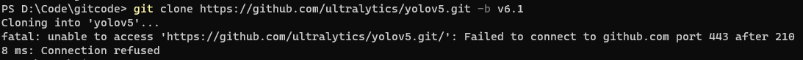
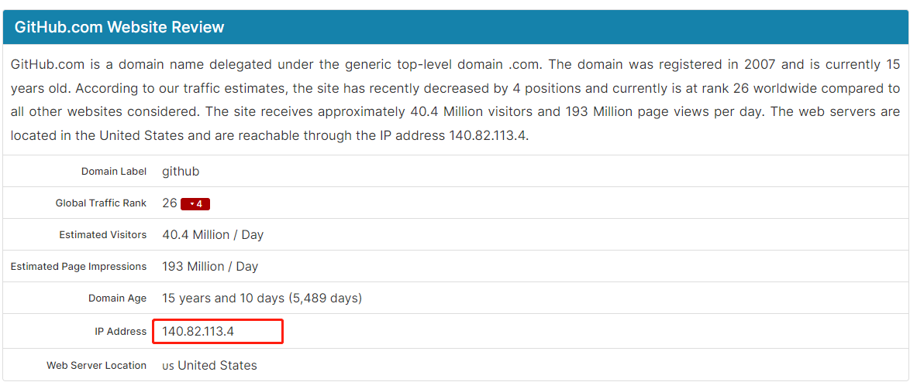
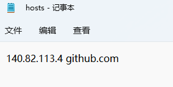
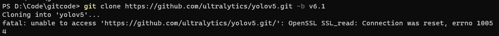
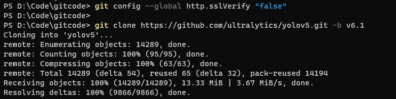

# Git报错:Failed to connect to github.com port 443 after 2123 ms: Connection

## 问题描述：


## 解决方法
1. 登录网站：https://www.ipaddress.com
2. 在打开的网站中将“github.com”复制到查询栏中进行搜索，可以看到域名对应的IP地址信息


3. 进入 C:\Windows\System32\drivers\etc 将搜索结果中展示的Ip地址和域名拷贝系统hosts文件中,没有的话，则创建一个hosts文件：


4. 如若遇到 “ OpenSSL SSL_read: Connection was reset, errno 10054” 问题，则解除验证：
```angular2html
git config --global http.sslVerify "false"
```


5. 再次Git代码:



