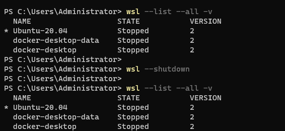
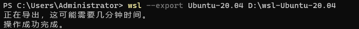
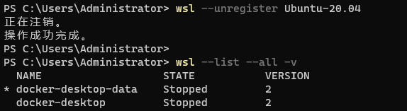

# WSL2子系统Ubuntu安装位置迁移

查看WSL列表
```
wsl --list --all -v
```
终止正在运行的分发或虚拟机
```angular2html
wsl --shutdown
```

对需要迁移的分发或虚拟机导出（我安装的版本是Ubuntu-20.04）：
```angular2html
wsl --export Ubuntu-20.04 D:\wsl-Ubuntu-20.04
```

卸载分发版或虚拟机
```angular2html
wsl --unregister Ubuntu-20.04
```

导入新的分发版或虚拟机
```angular2html
wsl --import Ubuntu-20.04 D:\WSL\Ubuntu2004 D:\wsl-Ubuntu-20.04 --version 2
```
设置默认分布版本
```angular2html
wsl -s Ubuntu-20.04
```
把默认登录用户还原成以前用的那个。
```
Ubuntu2004 config --default-user jinato
```
