# Win11+WSL2+Ubuntu20.04+CUDA+PYTORCH深度学习环境搭建

## 一、安装WSL2
1. 开启Windows功能： 系统设置 -> 应用 -> 可选功能 -> 最下边的 「更多 Windows 功能」 -> 找到并勾选 「Hyper-V」和「适用于 Linux 的 Windows 子系统」-> 点击确定
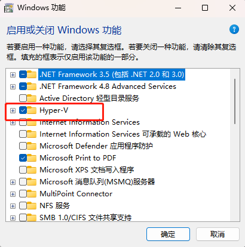
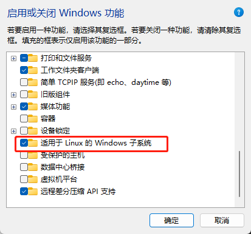
WRAN: 重启电脑

2. 配置和安装wsl2和ubuntu

官网文档：https://learn.microsoft.com/en-us/windows/ai/directml/gpu-cuda-in-wsl

```angular2html
# Wran: 以管理员身份运行terminal
# 安装wsl
wsl --install
# 设置版本为wsl2
wsl --set-default-version 2
# 更新wsl
wsl --update
# 查看可安装的Linux版本
wsl --list online
# 安装Ubuntu20.04
wsl --install -d Ubuntu-20.04
```
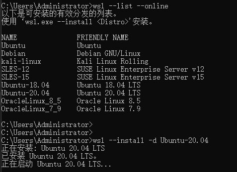
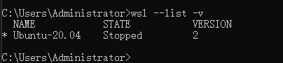

3. 换源

打开sources.list文件
```angular2html
sudo cp /etc/apt/sources.list /etc/apt/sources.list.bak
sudo chmod 777 /etc/apt/sources.list
sudo vim /etc/apt/sources.list
```
在vim的命令模式下按d,可以删除内容

按 i 变成编辑模式，把下面内容复制粘贴进去

先按ESC退回到命令模式，按 :wq 进行保存

```
# 阿里源
deb http://mirrors.aliyun.com/ubuntu/ bionic main restricted universe multiverse
deb-src http://mirrors.aliyun.com/ubuntu/ bionic main restricted universe multiverse
deb http://mirrors.aliyun.com/ubuntu/ bionic-security main restricted universe multiverse
deb-src http://mirrors.aliyun.com/ubuntu/ bionic-security main restricted universe multiverse
deb http://mirrors.aliyun.com/ubuntu/ bionic-updates main restricted universe multiverse
deb-src http://mirrors.aliyun.com/ubuntu/ bionic-updates main restricted universe multiverse
deb http://mirrors.aliyun.com/ubuntu/ bionic-proposed main restricted universe multiverse
deb-src http://mirrors.aliyun.com/ubuntu/ bionic-proposed main restricted universe multiverse
deb http://mirrors.aliyun.com/ubuntu/ bionic-backports main restricted universe multiverse
deb-src http://mirrors.aliyun.com/ubuntu/ bionic-backports main restricted universe multiverse

# 清华源
# 默认注释了源码镜像以提高 apt update 速度，如有需要可自行取消注释
deb https://mirrors.tuna.tsinghua.edu.cn/ubuntu/ bionic main restricted universe multiverse
# deb-src https://mirrors.tuna.tsinghua.edu.cn/ubuntu/ bionic main restricted universe multiverse
deb https://mirrors.tuna.tsinghua.edu.cn/ubuntu/ bionic-updates main restricted universe multiverse
# deb-src https://mirrors.tuna.tsinghua.edu.cn/ubuntu/ bionic-updates main restricted universe multiverse
deb https://mirrors.tuna.tsinghua.edu.cn/ubuntu/ bionic-backports main restricted universe multiverse
# deb-src https://mirrors.tuna.tsinghua.edu.cn/ubuntu/ bionic-backports main restricted universe multiverse
deb https://mirrors.tuna.tsinghua.edu.cn/ubuntu/ bionic-security main restricted universe multiverse
# deb-src https://mirrors.tuna.tsinghua.edu.cn/ubuntu/ bionic-security main restricted universe multiverse

# 预发布软件源，不建议启用
# deb https://mirrors.tuna.tsinghua.edu.cn/ubuntu/ bionic-proposed main restricted universe multiverse
# deb-src https://mirrors.tuna.tsinghua.edu.cn/ubuntu/ bionic-proposed main restricted universe multiverse
```
更新包：
```angular2html
sudo apt update
sudo apt upgrade
```
## 二、安装cuda toolkit
显卡安装，参考：[Win11深度学习环境搭建](https://jintaolu.github.io/2022/10/20/win11-shen-du-xue-xi-huan-jing-da-jian/)

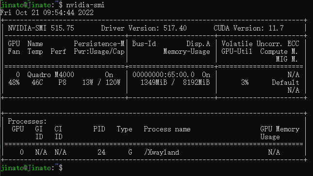

安装cuda toolkit，进入 https://developer.nvidia.com/cuda-toolkit-archive ，这里是需要登录的，请读者自行注册。按下图选择版本：
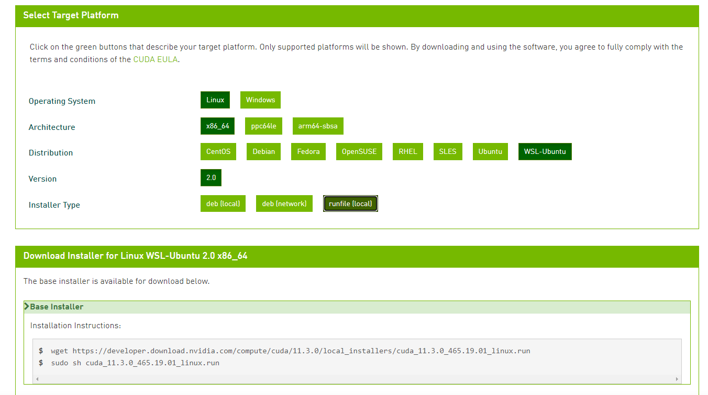
```angular2html
wget https://developer.download.nvidia.com/compute/cuda/11.3.0/local_installers/cuda_11.3.0_465.19.01_linux.run
sudo sh cuda_11.3.0_465.19.01_linux.run
```
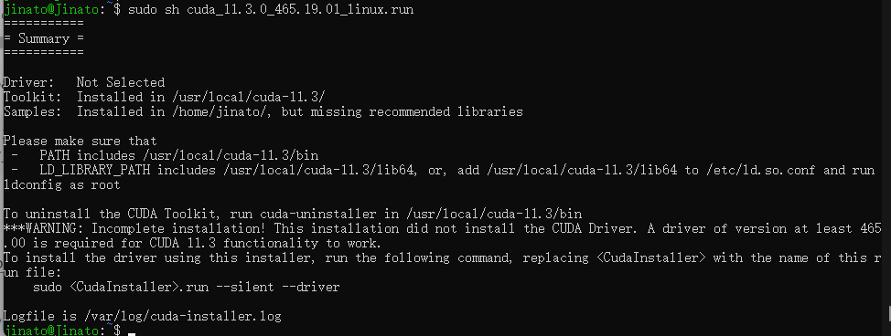

安装完成后，在~/.bashrc中加入环境变量：
```angular2html
vim ~/.bashrc

export PATH=/usr/local/cuda-11.3/bin:$PATH
export LD_LIBRARY_PATH=/usr/local/cuda-11.3/lib64:$LD_LIBRARY_PATH

source ~/.bashrc
```

验证是否安装成功
```angular2html
nvcc -V
```
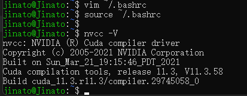

## 三、安装cuDNN
官网： https://developer.nvidia.com/zh
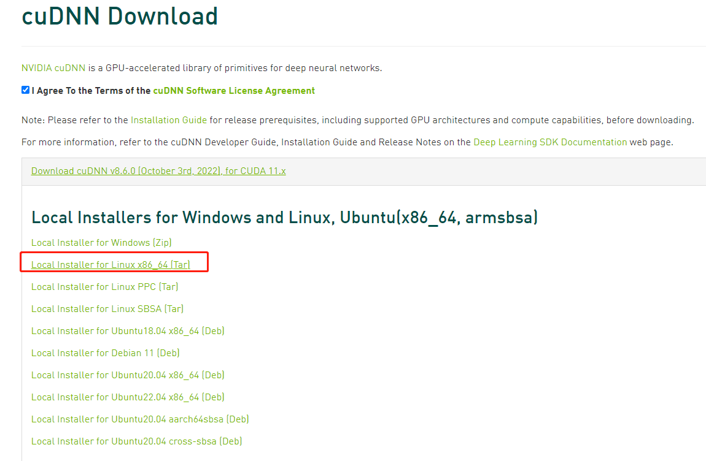
```angular2html
sudo tar -xvf cudnn-linux-x86_64-8.6.0.163_cuda11-archive.tar.xz
sudo cp cudnn-linux-x86_64-8.6.0.163_cuda11-archive/lib/libcudnn* /usr/local/cuda-11.3/lib64/
sudo cp cudnn-linux-x86_64-8.6.0.163_cuda11-archive/include/cudnn.h /usr/local/cuda-11.3/include/
sudo cp cudnn-linux-x86_64-8.6.0.163_cuda11-archive/include/cudnn_version.h /usr/local/cuda-11.3/include/ 
sudo chmod a+r /usr/local/cuda-11.3/include/cudnn.h 
sudo chmod a+r /usr/local/cuda-11.3/lib64/libcudnn*
```
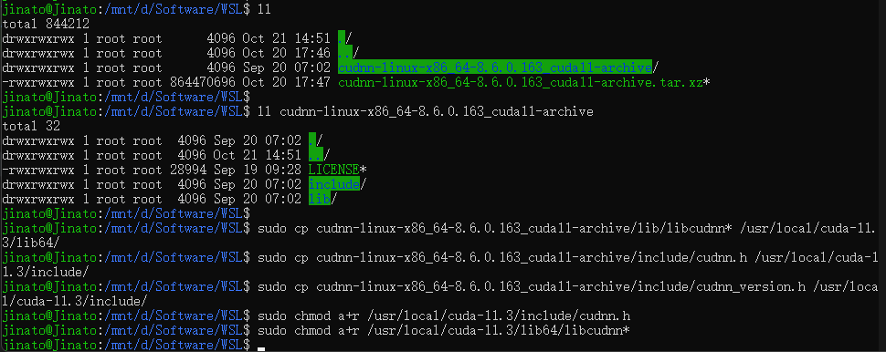

## 四、安装Miniconda
```angular2html
# 下载miniconda
wget https://repo.anaconda.com/miniconda/Miniconda3-latest-Linux-x86_64.sh
# 修改运行权限
chmod 777 Miniconda3-latest-Linux-x86_64.sh
# 运行安装脚本
./Miniconda3-latest-Linux-x86_64.sh
一直按回车，在需要输入yes的时候输入yes
```
添加变量到bashrc中
```angular2html
vim ~/.bashrc
export PATH=/home/你的用户名/miniconda3/bin:$PATH
source ~/.bashrc
```

conda换源
```angular2html
conda config --add channels https://mirrors.tuna.tsinghua.edu.cn/anaconda/pkgs/free/
conda config --add channels https://mirrors.tuna.tsinghua.edu.cn/anaconda/cloud/conda-forge 
conda config --add channels https://mirrors.tuna.tsinghua.edu.cn/anaconda/cloud/msys2/

conda config --set show_channel_urls yes
```
pip换源
```angular2html
pip install pip -U
pip config set global.index-url https://pypi.tuna.tsinghua.edu.cn/simple
```
## 五、安装torch
```angular2html
pip3 install torch torchvision torchaudio --extra-index-url https://download.pytorch.org/whl/cu113
或
conda install pytorch torchvision torchaudio cudatoolkit=11.3 -c pytorch
```
验证是否能使用GPU
```angular2html
import torch
torch.cuda.is_available()
```
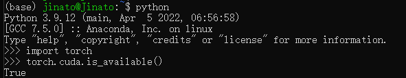

**如果输出显示为False，则尝试重启Ubuntu，再试一试**

**参考：**
1. https://zhuanlan.zhihu.com/p/436393852
2. https://www.jianshu.com/p/e8401bbce562
3. https://blog.csdn.net/Rayone_/article/details/124410685