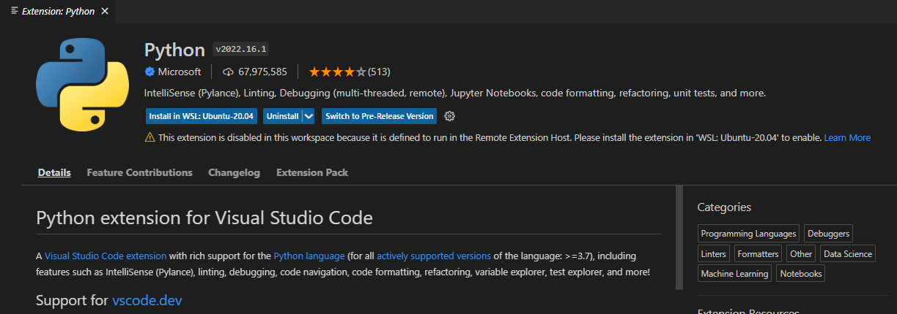

# Win11+WSL2+docker+GPU+VSCode环境搭建

## 一、WSL2安装
参见：

## 二、Docker Desktop安装
官网地址：https://docs.docker.com/desktop/windows/wsl/#download

docker设置

设置docker的wsl发行版

设置国内源

验证docker版本

拉取docker镜像
```angular2html
docker pull nginx
```

打开浏览器，输入``http://localhost``

## 三、安装 NVIDIA Container Toolkit
依次执行命令
```angular2html
distribution=$(. /etc/os-release;echo $ID$VERSION_ID)
curl -s -L https://nvidia.github.io/nvidia-docker/gpgkey | sudo apt-key add -
curl -s -L https://nvidia.github.io/nvidia-docker/$distribution/nvidia-docker.list | sudo tee /etc/apt/sources.list.d/nvidia-docker.list
sudo apt-get update
sudo apt-get install -y nvidia-docker2
```
如果出现以下问题

依次执行下面命令，建立软链接，注意修改对应版本
```angular2html
sudo ln -sf /usr/local/cuda-11.3/lib64/libcudnn.so.8.6.0 /usr/local/cuda-11.3/lib64/libcudnn.so.8       
sudo ln -sf /usr/local/cuda-11.3/targets/x86_64-linux/lib/libcudnn_cnn_infer.so.8.6.0 /usr/local/cuda-11.3/targets/x86_64-linux/lib/libcudnn_cnn_infer.so.8
sudo ln -sf /usr/local/cuda-11.3/targets/x86_64-linux/lib/libcudnn_adv_infer.so.8.6.0 /usr/local/cuda-11.3/targets/x86_64-linux/lib/libcudnn_adv_infer.so.8
sudo ln -sf /usr/local/cuda-11.3/targets/x86_64-linux/lib/libcudnn_adv_train.so.8.6.0 /usr/local/cuda-11.3/targets/x86_64-linux/lib/libcudnn_adv_train.so.8
sudo ln -sf /usr/local/cuda-11.3/targets/x86_64-linux/lib/libcudnn_ops_train.so.8.6.0 /usr/local/cuda-11.3/targets/x86_64-linux/lib/libcudnn_ops_train.so.8
sudo ln -sf /usr/local/cuda-11.3/targets/x86_64-linux/lib/libcudnn_ops_infer.so.8.6.0 /usr/local/cuda-11.3/targets/x86_64-linux/lib/libcudnn_ops_infer.so.8
sudo ln -sf /usr/local/cuda-11.3/targets/x86_64-linux/lib/libcudnn_cnn_train.so.8.6.0 /usr/local/cuda-11.3/targets/x86_64-linux/lib/libcudnn_cnn_train.so.8
```
## 四、Docker PyTorch镜像
拉取PyTorch的Docker镜像,进入容器，验证GPU是否可用
```angular2html
docker pull pytorch/pytorch
docker run --runtime=nvidia  -it --name torch pytorch/pytorch
```


## 五、VSCode使用WLS
VSCode安装略过。VSCode的WSL和python插件安装

安装完后，在Remote Explore中的WSL Targets下会在WSL的显示

VSCode的WSL的python插件安装

WSL下启动vscode, ``code .``

选择解释器后，运行结果

