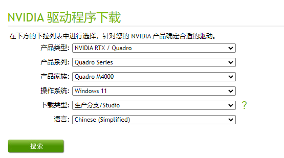
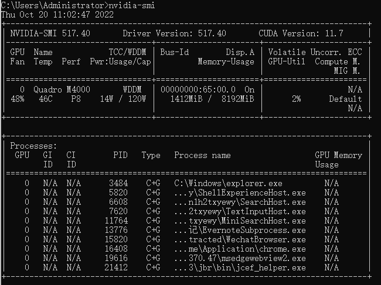
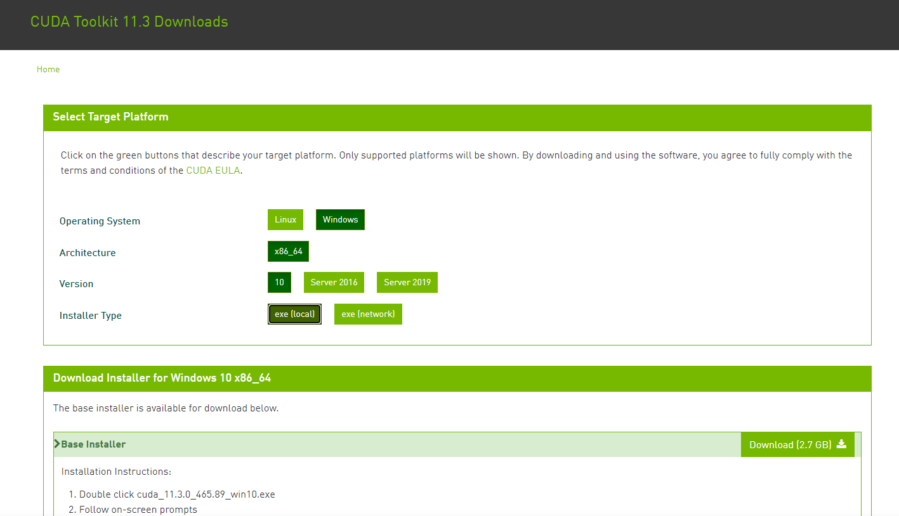
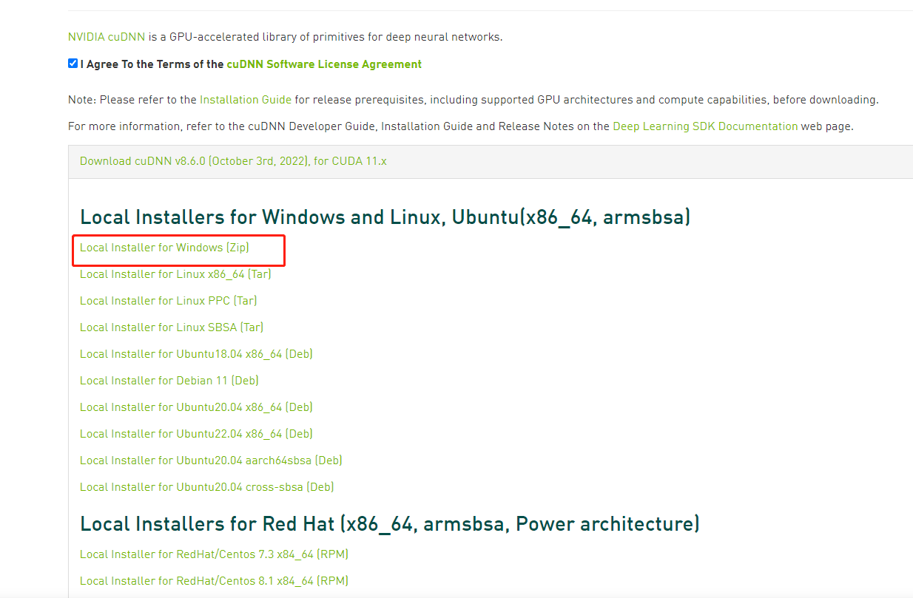
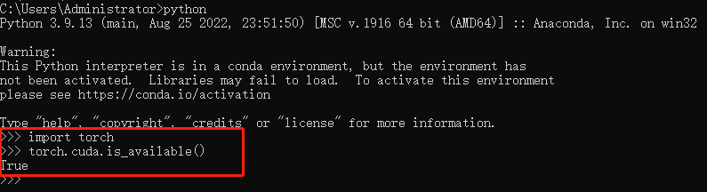

# Win11深度学习环境搭建

台式机电脑配置：
* CPU： Intel(R) Xeon(R) W-2123 CPU @ 3.60GHz   3.60 GHz
* GPU： NVIDIA Quadro M4000
* OS ： Windows 11 专业版

## 一、显卡驱动安装
NVIDIA显卡驱动官网地址：https://www.nvidia.cn/Download/index.aspx?lang=cn



可用nvidia-smi验证是否安装正常：


## 二、CUDA安装
nvidia官网下载对应版本：https://developer.nvidia.cn/cuda-toolkit-archive
我这里选择的是cuda11.3.0离线安装，在线装网络不稳定。


## 三、cudnn安装
点击: https://developer.nvidia.com/cuda-toolkit-archive 
找到对应版本（11.3.0）的安装包并下载(需要注册账号)：


## PyTorch安装
先安装anaconda（省略安装过程），安装命令：
```angular2html
conda install pytorch torchvision torchaudio cudatoolkit=11.3 -c pytorch
```
验证cuda是否可用：
