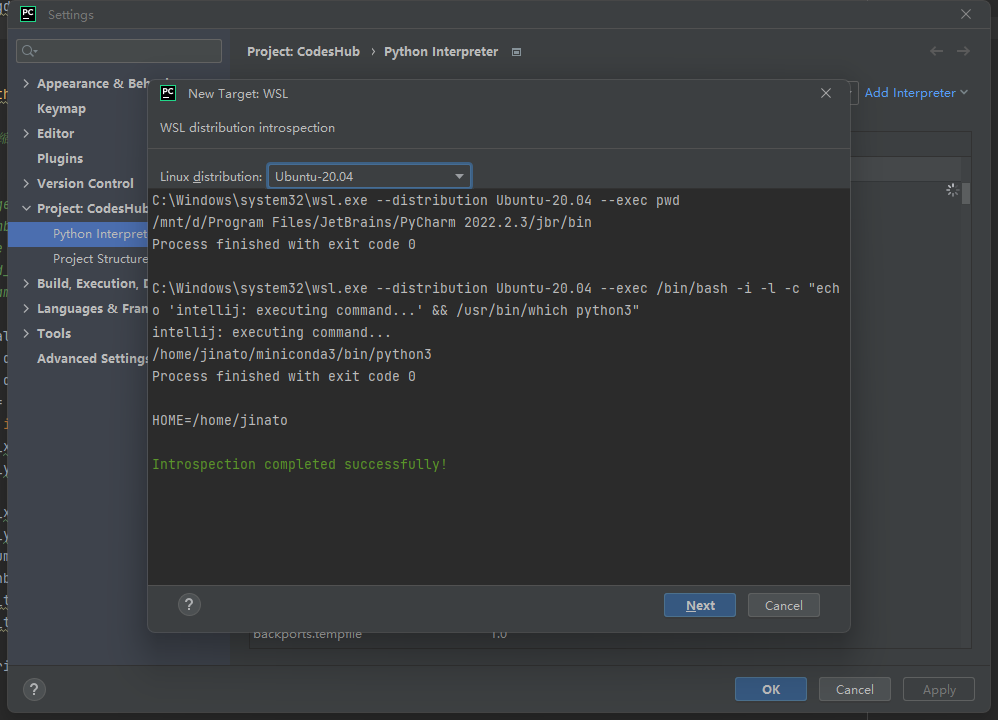
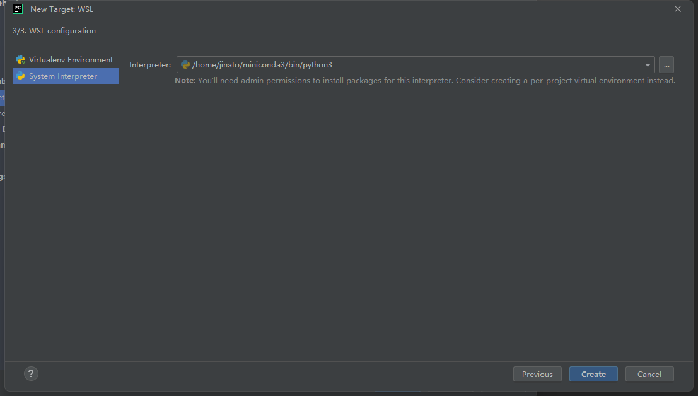
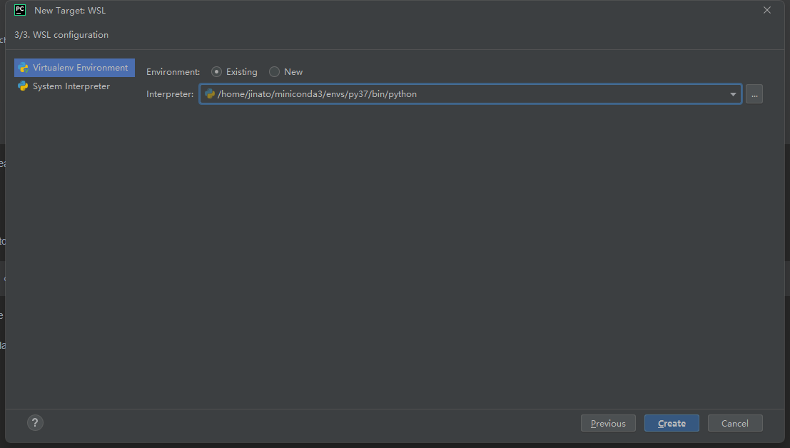
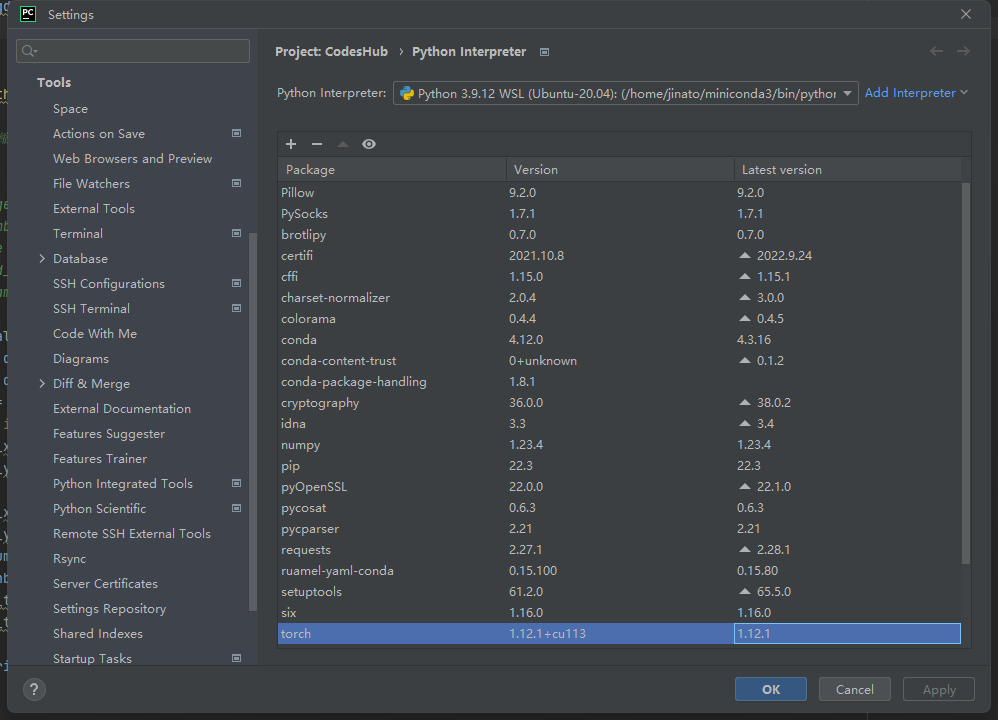
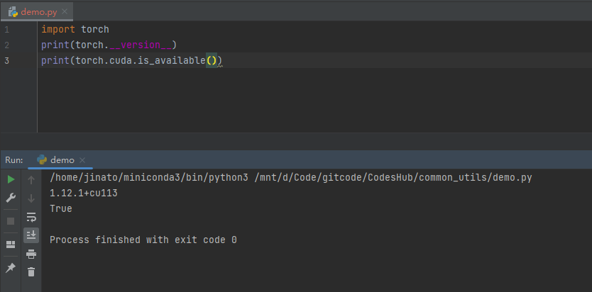
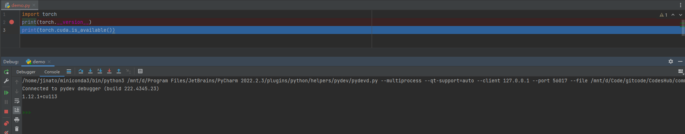

# 在Win11的WSL2下使用PyCharm运行PyTorch

## 一、配置WSL解释器
设置项目解释器

设置System Interpreter 或 WSL2里的虚拟环境（已存在或新建）

配置完成

## 二、配置Terminal
设置终端Terminal,将Shell path改为wsl.exe
![](./在Win11的WSL2下使用PyCharm运行PyTorch/pycharm_interpreter4.png
## 三、正常运行

## 四、调试
会弹出防火墙信息弹窗，点允许即可
